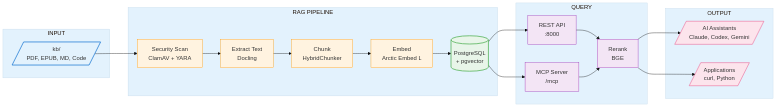

# RAG-KB

[](https://github.com/KatanaQuant/rag-kb/releases)
[](https://github.com/KatanaQuant/rag-kb)
[](LICENSE)

**Personal knowledge base with semantic search.** Index books, code, and notes—query with natural language. 100% local.

**Current Version**: v2.3.0-beta ([Changelog](docs/RELEASES/)) | **Latest Stable**: [v1.9.1](https://github.com/KatanaQuant/rag-kb/releases/tag/v1.9.1)

> **MIGRATION GUIDE**
>
> | From | To | Action |
> |------|----|--------|
> | **v1.x** | v2.3.0-beta | Fresh install recommended. Directory: `knowledge_base/` → `kb/` |
> | **v2.1.5, v2.2.0-2.2.2** | v2.3.0-beta | Upgrade directly (skip v2.2.4). These versions have known bugs. |
> | **v2.2.4-beta** | v2.3.0-beta | Standard upgrade. |
>
> See [v2.3.0 Release Notes](docs/RELEASES/v2.3.0-beta.md) for details.

---

## Features

- **Semantic Search** - Natural language queries across all documents
- **Multi-Format** - PDF, EPUB, Markdown, Code (Python/Java/TS/Go/C#), Jupyter, Obsidian
- **IDE Integration** - Works with Claude Code, Cursor, Codex, Gemini, Amp via MCP
- **Network Ready** - HTTP transport for local and remote access
- **Security Scanning** - ClamAV, YARA, hash blacklist (auto-quarantine)
- **Self-Healing** - Auto-repair database issues at startup
- **100% Local** - No external APIs, complete privacy

---

## Quick Start

```bash
# Clone and start
git clone https://github.com/KatanaQuant/rag-kb.git
cd rag-kb && git checkout v2.3.0-beta

# Add your content
cp ~/Documents/*.pdf kb/books/

# Build and run
export DOCKER_BUILDKIT=1
docker-compose up --build -d

# Verify
curl http://localhost:8000/health
```

See [docs/QUICK_START.md](docs/QUICK_START.md) for detailed setup.

---

## Usage

### REST API
```bash
curl -X POST http://localhost:8000/query \
  -H "Content-Type: application/json" \
  -d '{"text": "your question", "top_k": 5}'
```

### IDE Integration (MCP)
Query your knowledge base directly from your AI assistant:

```bash
# Claude Code, Codex, Gemini, Amp - all use HTTP transport
claude mcp add --transport http --scope user rag-kb http://localhost:8000/mcp
```

See [docs/MCP.md](docs/MCP.md) for setup guides for all supported IDEs.

See [docs/USAGE.md](docs/USAGE.md) for all query methods and [docs/API.md](docs/API.md) for full API reference.

---

## Documentation

| Guide | Description |
|-------|-------------|
| [QUICK_START.md](docs/QUICK_START.md) | Get running in 5 minutes |
| [USAGE.md](docs/USAGE.md) | Query methods, content ingestion |
| [API.md](docs/API.md) | Complete API reference |
| [MCP.md](docs/MCP.md) | IDE integration (Claude, Codex, Gemini, Amp) |
| [CONFIGURATION.md](docs/CONFIGURATION.md) | Infrastructure settings (.env) |
| [PIPELINE.md](docs/PIPELINE.md) | ML pipeline config, hardware profiles |
| [EXTENDING.md](docs/EXTENDING.md) | Custom extractors, chunkers, embedders |
| [SECURITY.md](docs/SECURITY.md) | Malware detection setup |
| [MAINTENANCE.md](docs/MAINTENANCE.md) | Database health, self-healing |
| [TROUBLESHOOTING.md](docs/TROUBLESHOOTING.md) | Common issues |
| [DEVELOPMENT.md](docs/DEVELOPMENT.md) | Architecture, testing |
| [ROADMAP.md](docs/ROADMAP.md) | Project roadmap |
| [RELEASES/](docs/RELEASES/) | Version history |
| [domain/](docs/domain/) | Domain model (DDD glossary, context map) |

---

## Architecture



**Ingestion**: Files → Security Scan → Chunk → Embed → Store

**Query**: Question → Embed → Vector Search → Ranked Results

---

## Updating

```bash
docker-compose down
git fetch --tags && git checkout v2.3.0-beta
docker-compose build --no-cache
docker-compose up -d
```

Your data (PostgreSQL volume, `kb/`) persists across updates.

---

## Support

- **Contact**: horoshi@katanaquant.com
- **GitHub**: [KatanaQuant/rag-kb](https://github.com/KatanaQuant/rag-kb)

---

## License

[CC BY-NC 4.0](LICENSE) - Non-commercial use only
