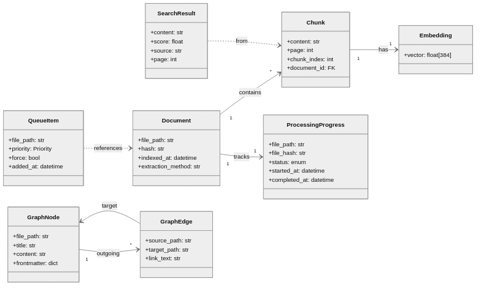

# Aggregates

> Domain aggregates and their relationships in RAG-KB

Aggregates are clusters of domain objects treated as a single unit for data changes. Each aggregate has a root entity that controls access to its members.

---

## Document Aggregate

The core aggregate representing an indexed file.

```
┌─────────────────────────────────────────┐
│            Document (Root)               │
├─────────────────────────────────────────┤
│ - file_path: str                        │
│ - hash: str (SHA-256)                   │
│ - indexed_at: datetime                  │
│ - extraction_method: str                │
├─────────────────────────────────────────┤
│ + Chunk[]                               │
│ + ProcessingProgress                    │
└─────────────────────────────────────────┘
```

**Root Entity**: `Document`

**Child Entities**:
- `Chunk` - Text segments with embeddings

**Value Objects**:
- `DocumentIdentity` (path + hash + name)
- `FileHash` (SHA-256 string)
- `ExtractionMethod` (docling, ast_python, etc.)

**Invariants**:
- Document must have unique file_path
- Hash must match file content
- At least one chunk after successful processing

---

## Chunk Aggregate

Represents a semantically coherent text segment.

```
┌─────────────────────────────────────────┐
│              Chunk (Root)                │
├─────────────────────────────────────────┤
│ - content: str                          │
│ - page: int                             │
│ - chunk_index: int                      │
│ - document_id: FK                       │
├─────────────────────────────────────────┤
│ + Embedding                             │
│ + FTSEntry                              │
└─────────────────────────────────────────┘
```

**Root Entity**: `Chunk`

**Value Objects**:
- `Embedding` (float[384] vector)
- `ChunkMetadata` (page, position, source)

**Invariants**:
- Content must not be empty
- Must belong to a Document
- Embedding dimension must match model (384)

---

## Queue Item Aggregate

Represents a document pending processing.

```
┌─────────────────────────────────────────┐
│            QueueItem (Root)              │
├─────────────────────────────────────────┤
│ - file_path: str                        │
│ - priority: Priority                    │
│ - force: bool                           │
│ - added_at: datetime                    │
└─────────────────────────────────────────┘
```

**Root Entity**: `QueueItem`

**Value Objects**:
- `Priority` (URGENT=0, HIGH=1, NORMAL=2, LOW=3)

**Invariants**:
- File path must exist
- Priority must be valid enum value

---

## Search Result Aggregate

Represents a ranked search result.

```
┌─────────────────────────────────────────┐
│          SearchResult (Root)             │
├─────────────────────────────────────────┤
│ - content: str                          │
│ - score: float                          │
│ - source: str                           │
│ - page: int                             │
│ - metadata: dict                        │
└─────────────────────────────────────────┘
```

**Root Entity**: `SearchResult`

**Value Objects**:
- `RelevanceScore` (0.0 to 1.0)
- `SourceReference` (file path + page)

**Invariants**:
- Score must be between 0.0 and 1.0
- Source must reference indexed document

---

## Processing Progress Aggregate

Tracks document processing state for resumability.

```
┌─────────────────────────────────────────┐
│       ProcessingProgress (Root)          │
├─────────────────────────────────────────┤
│ - file_path: str                        │
│ - file_hash: str                        │
│ - status: ProcessingStatus              │
│ - extraction_method: str                │
│ - started_at: datetime                  │
│ - completed_at: datetime                │
│ - error_message: str                    │
└─────────────────────────────────────────┘
```

**Root Entity**: `ProcessingProgress`

**Value Objects**:
- `ProcessingStatus` (pending, completed, rejected, failed)

**Invariants**:
- Status transitions: pending → completed | rejected | failed
- completed_at only set when status is completed

---

## Graph Node Aggregate (Obsidian)

Represents a note in the Obsidian knowledge graph.

```
┌─────────────────────────────────────────┐
│            GraphNode (Root)              │
├─────────────────────────────────────────┤
│ - file_path: str                        │
│ - title: str                            │
│ - content: str                          │
│ - frontmatter: dict                     │
├─────────────────────────────────────────┤
│ + GraphEdge[] (outgoing)                │
└─────────────────────────────────────────┘
```

**Root Entity**: `GraphNode`

**Child Entities**:
- `GraphEdge` - Links to other nodes

**Value Objects**:
- `Frontmatter` (YAML metadata)
- `WikiLink` (link text + target)

**Invariants**:
- Node must have unique file_path within vault
- Edges must reference existing nodes

---

## Indexing Stats Value Object

Immutable statistics about indexing operations.

```
┌─────────────────────────────────────────┐
│         IndexingStats (VO)               │
├─────────────────────────────────────────┤
│ - files_indexed: int                    │
│ - chunks_created: int                   │
│ - files_skipped: int                    │
│ - files_failed: int                     │
├─────────────────────────────────────────┤
│ + add(other: IndexingStats)             │
│ + add_file(chunks: int)                 │
└─────────────────────────────────────────┘
```

**Behavior**:
- Immutable - operations return new instances
- Additive - can combine stats from multiple operations

---

## Processing Result Value Object

Outcome of processing a single document.

```
┌─────────────────────────────────────────┐
│       ProcessingResult (VO)              │
├─────────────────────────────────────────┤
│ - status: ResultStatus                  │
│ - message: str                          │
│ - chunks_count: int                     │
├─────────────────────────────────────────┤
│ + skipped(reason: str)                  │
│ + success(chunks: int)                  │
│ + failure(error: str)                   │
└─────────────────────────────────────────┘
```

**Factory Methods**:
- `ProcessingResult.skipped("Already indexed")`
- `ProcessingResult.success(chunks=15)`
- `ProcessingResult.failure("Extraction error")`

---

## Aggregate Relationships



---

## Repository Mapping

| Aggregate | Repository | Table(s) |
|-----------|------------|----------|
| Document | `DocumentRepository` | `documents` |
| Chunk | `ChunkRepository` | `chunks`, `vec_chunks`, `chunks_fts` |
| QueueItem | `IndexingQueue` | (in-memory) |
| SearchResult | `SearchRepository` | `vec_chunks`, `chunks_fts` |
| ProcessingProgress | `ProcessingProgressTracker` | `processing_progress` |
| GraphNode | `NodeRepository` | `graph_nodes` |
| GraphEdge | `EdgeRepository` | `graph_edges` |

---

*Last updated: 2025-12-03*
