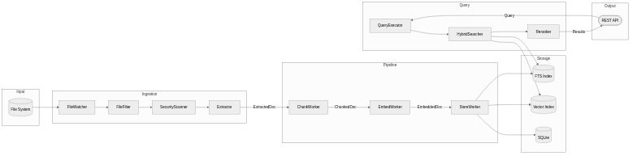

# Context Map

> Bounded Context relationships for RAG-KB

RAG-KB is organized into six bounded contexts that collaborate to provide semantic search over personal documents.

---

## Context Overview

```
┌─────────────┐     ┌─────────────┐     ┌─────────────┐
│  Ingestion  │ ──> │  Pipeline   │ ──> │   Storage   │
└─────────────┘     └─────────────┘     └─────────────┘
       │                   │                   │
       v                   v                   v
┌─────────────┐     ┌─────────────┐     ┌─────────────┐
│  Security   │     │  Indexing   │     │    Query    │
└─────────────┘     └─────────────┘     └─────────────┘
```

---

## Bounded Contexts

### 1. Document Ingestion Context

**Purpose**: Accept documents, validate format, extract text content

**Location**: `api/ingestion/`

**Key Aggregates**:
- `DocumentProcessor` - Orchestrates extraction
- `ExtractionRouter` - Routes to specialized extractors
- `FileTypeValidator` - Validates file formats

**Upstream**: File system (external)
**Downstream**: Pipeline Context

---

### 2. Chunking Pipeline Context

**Purpose**: Transform extracted text into embedded chunks

**Location**: `api/pipeline/`

**Key Aggregates**:
- `PipelineCoordinator` - Orchestrates stages
- `EmbedWorkerPool` - Parallel embedding workers
- `PipelineFactory` - Creates components from config

**Upstream**: Ingestion Context
**Downstream**: Storage Context

---

### 3. Storage Context

**Purpose**: Persist documents, chunks, and embeddings

**Location**: `api/ingestion/` (repositories)

**Technology**: PostgreSQL + pgvector for vector storage and similarity search

**Key Aggregates**:
- `VectorStore` / `AsyncVectorStore` - Vector persistence
- `DocumentRepository` - Document metadata
- `ChunkRepository` - Chunk content and vectors

**Abstraction Layer**:
- `DatabaseFactory` - Runtime backend selection (PostgreSQL or SQLite)
- ABC interfaces in `interfaces.py` define contracts for all repositories

**Upstream**: Pipeline Context
**Downstream**: Query Context

---

### 4. Query Context

**Purpose**: Execute semantic search and return ranked results

**Location**: `api/operations/`, `api/routes/query.py`

**Key Aggregates**:
- `QueryExecutor` - Search orchestrator
- `HybridSearcher` - Vector + FTS search (ABC with backend implementations)
- `QueryCache` - Result caching

**Upstream**: Storage Context (reads)
**Downstream**: API (external)

---

### 5. Indexing Context

**Purpose**: Manage document processing queue and lifecycle

**Location**: `api/pipeline/`, `api/operations/`

**Key Aggregates**:
- `IndexingQueue` - Priority queue
- `OrphanDetector` - Find incomplete documents
- `FileWatcherService` - Monitor file changes

**Abstraction Layer**:
- `OperationsFactory` - Creates backend-agnostic maintenance operations

**Upstream**: File system events
**Downstream**: Pipeline Context

---

### 6. Security Context

**Purpose**: Validate documents against malware and suspicious patterns

**Location**: `api/ingestion/`

**Key Aggregates**:
- `SecurityScanner` - ClamAV/YARA scanning
- `QuarantineManager` - Isolate suspicious files
- `ValidationStrategies` - Composable validation rules

**Upstream**: Ingestion Context
**Downstream**: Quarantine (file system)

---

## Context Relationships

```
Ingestion ──(Customer-Supplier)──> Pipeline
Pipeline ──(Customer-Supplier)──> Storage
Storage ──(Shared Kernel)──> Query
Indexing ──(Customer-Supplier)──> Pipeline
Security ──(Conformist)──> Ingestion
```

### Relationship Types Used

| Pattern | Description | Usage in RAG-KB |
|---------|-------------|-----------------|
| **Customer-Supplier** | Upstream provides what downstream needs | Ingestion -> Pipeline -> Storage |
| **Shared Kernel** | Shared code/models between contexts | Storage <-> Query (same DB, repositories) |
| **Conformist** | Downstream conforms to upstream model | Security validates what Ingestion accepts |

---

## Integration Patterns

| Upstream | Downstream | Pattern | Interface |
|----------|------------|---------|-----------|
| Ingestion | Pipeline | Customer-Supplier | `ExtractedDocument` |
| Pipeline | Storage | Customer-Supplier | `EmbeddedDocument` |
| Storage | Query | Shared Kernel | `AsyncVectorStore` |
| Indexing | Pipeline | Customer-Supplier | `QueueItem` |
| Security | Ingestion | Conformist | `ValidationResult` |

---

## Data Flow

```
File System
    │
    v
┌─────────────────────────────────────────────────────────┐
│                    INGESTION CONTEXT                     │
│  FileWatcher -> FileFilter -> SecurityScanner -> Extractor │
└─────────────────────────────────────────────────────────┘
    │
    │ ExtractedDocument
    v
┌─────────────────────────────────────────────────────────┐
│                    PIPELINE CONTEXT                      │
│  ChunkWorker -> EmbedWorkerPool -> StoreWorker            │
└─────────────────────────────────────────────────────────┘
    │
    │ EmbeddedDocument
    v
┌─────────────────────────────────────────────────────────┐
│                    STORAGE CONTEXT                       │
│  DocumentRepository -> ChunkRepository -> VectorStore     │
│  (PostgreSQL + pgvector, abstracted via DatabaseFactory) │
└─────────────────────────────────────────────────────────┘
    │
    │ (reads)
    v
┌─────────────────────────────────────────────────────────┐
│                     QUERY CONTEXT                        │
│  QueryExecutor -> HybridSearcher -> Reranker -> Cache      │
└─────────────────────────────────────────────────────────┘
    │
    v
API Response
```

---

## Anti-Corruption Layers

| Location | Purpose |
|----------|---------|
| `ExtractionResult` | Isolates extractor internals from pipeline |
| `QueueItem` | Abstracts queue implementation from consumers |
| `SearchResult` | Transforms DB rows to domain model |
| `PipelineFactory` | Isolates YAML config from runtime components |
| `DatabaseFactory` | Isolates database backend from application code |
| `OperationsFactory` | Isolates maintenance operations from backend specifics |

---

## Diagrams

### Context Map


### Data Flow



---

*Last updated: 2025-12-08*
